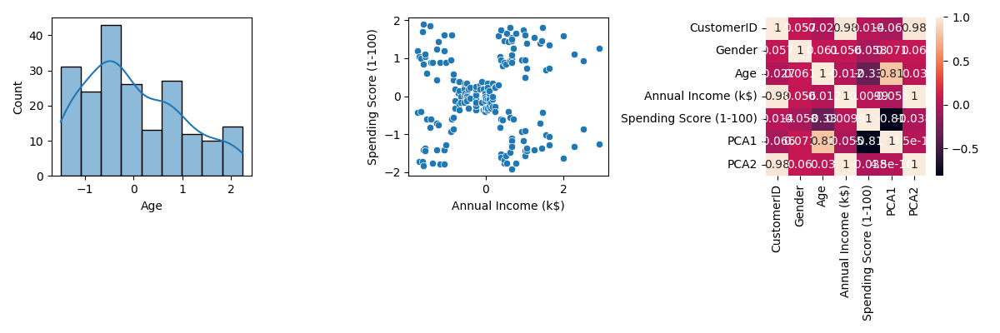

# Customer Analytics Pipeline

## Team Members
- Shehab Hegazy

---

## Description
This project implements a full data analytics pipeline using Docker. The pipeline processes a raw customer dataset, performs preprocessing, generates insights, visualizations, and clustering results.

## Dataset
**Mall Customer Segmentation Dataset**  
Contains customer ID, gender, age, annual income (k$), and spending score (1–100).

---

## Project Structure
```
customer-analytics/
├── Dockerfile
├── ingest.py
├── preprocess.py
├── analytics.py
├── visualize.py
├── cluster.py
├── summary.sh
├── README.md
├── dataset.csv
└── results/
    ├── data_raw.csv
    ├── data_preprocessed.csv
    ├── insight1.txt
    ├── insight2.txt
    ├── insight3.txt
    ├── summary_plot.png
    └── clusters.txt
```

---

## Docker Commands

### Build the image
```bash
docker build -t customer-analytics .
```

### Run the container
```bash
docker run -it --name customer-analytics-run customer-analytics
```

### Inside the container — run the full pipeline
```bash
python ingest.py dataset.csv
```

### Exit the container
```bash
exit
```

### On the host — copy results and clean up
```bash
bash summary.sh
```

---

## Pipeline Execution Flow

```
python ingest.py dataset.csv
        │
        ▼
    ingest.py         → loads dataset.csv, saves data_raw.csv
        │
        ▼
  preprocess.py       → cleans, discretizes, encodes, scales, applies PCA
                        saves data_preprocessed.csv
        │
        ▼
  analytics.py        → computes stats, saves insight1.txt / insight2.txt / insight3.txt
        │
        ▼
  visualize.py        → creates histogram, scatterplot, heatmap → saves summary_plot.png
        │
        ▼
   cluster.py         → applies K-Means (k=3), saves clusters.txt
```

> Each script automatically calls the next one via `import`, so the entire pipeline runs from a single command.

---

## Preprocessing Steps

| Stage | Method | Detail |
|---|---|---|
| Data Cleaning | `dropna()`, `drop_duplicates()` | Remove nulls and duplicate rows |
| Discretization | `pd.cut()` | Bin Age into Young / Middle / Old |
| Feature Encoding | `LabelEncoder` | Encode Gender (Male=1, Female=0) |
| Feature Scaling | `StandardScaler` | Normalize Age, Income, Spending Score |
| Dimensionality Reduction | `PCA(n_components=2)` | Reduce to PCA1, PCA2 |

---

## Sample Outputs

### insight1.txt
```
Average age: 39
```

### insight2.txt
```
Max income: 137
```

### insight3.txt
```
Average spending score: 50.2
```

### clusters.txt
```
Cluster 0: 73 customers
Cluster 1: 54 customers
Cluster 2: 73 customers
```

### summary_plot.png


---

## Docker Hub
https://hub.docker.com/r/r2a3d/customer-analytics

```bash
docker pull r2a3d/customer-analytics
```

## GitHub
https://github.com/Crypto-sys-ux/Big-Data-Assignment
